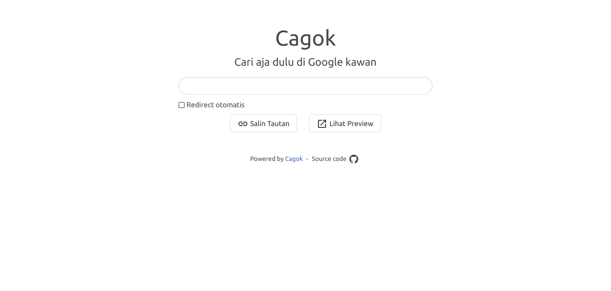
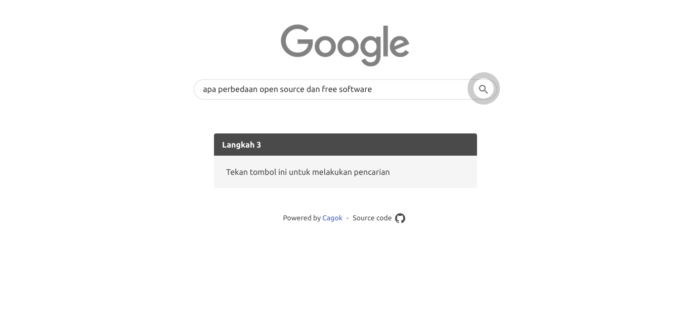

# Cagok - Cari Aja Dulu Di Google Kawan





Pernahkah kamu sering ditanyain sama temen kamu tentang suatu hal tapi temen kamu males cari di Google? Cagok akan memberi tutorial cara menggunakan Google biar temen kamu gak males dan suruh nyari sendiri.

## Bagaimana Caranya?

Simple aja, kunjungi website Cagok lalu ketik pencarian atau pertanyaan yang ingin dicari lalu kasih tautan ke teman kamu. Kamu bisa menggunakan website https://cagok.slayerwitch.my.id untuk mencobanya atau hosting sendiri jika mau ;)

## Project Setup

Install dependencies Cagok menggunakan pnpm

```sh
pnpm install
```

Setting file `.env` sesuai kebutuhan 

```
VITE_APP_BASE='http://localhost' #don't insert the backslash (/)
VITE_APP_TITLE='Cagok'
VITE_APP_DESCRIPTION='Cagok - Cari aja dulu di Google kawan'
VITE_APP_IMAGE_URL='/cagok-thumb.png'
```

Build Cagok untuk deploy ke server

```sh
pnpm build
```

### Perintah Yang Tersedia

```sh
pnpm lint
pnpm dev
pnpm preview
pnpm format
```

Silahkan lihat file `package.json` untuk perintah lebih lengkapnya
